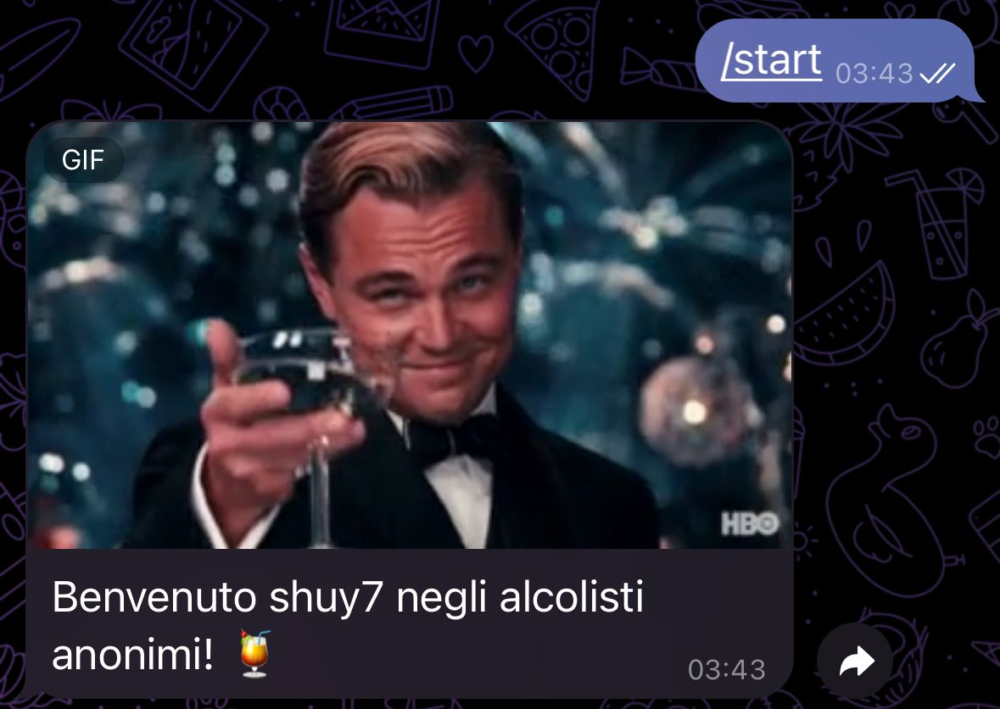
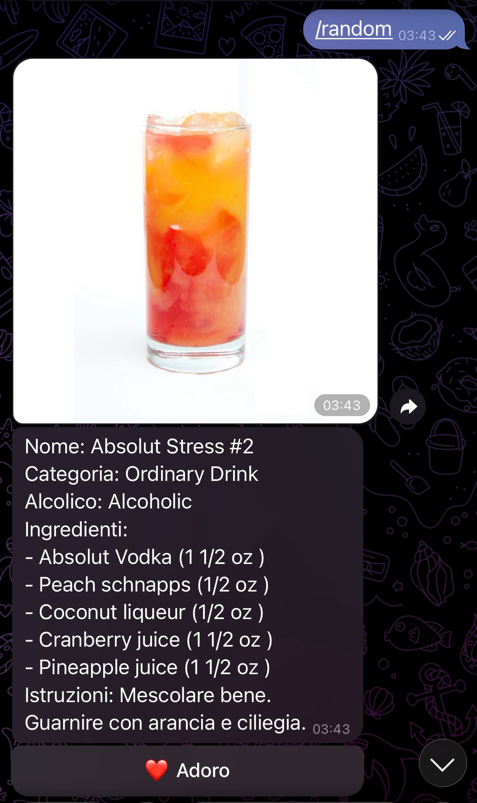
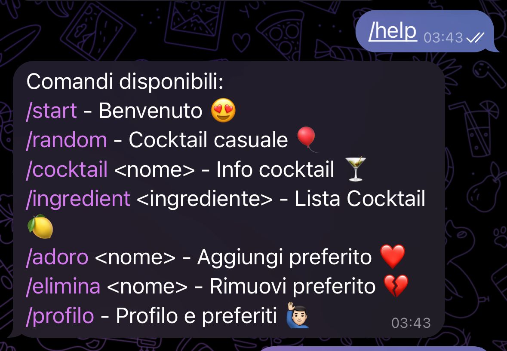
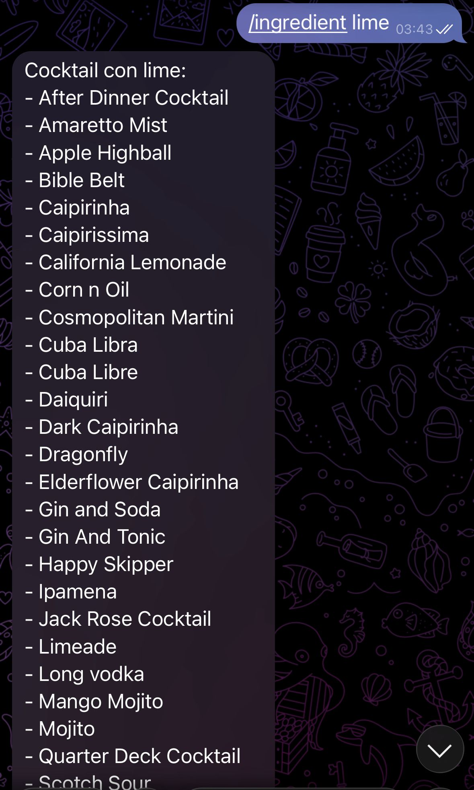
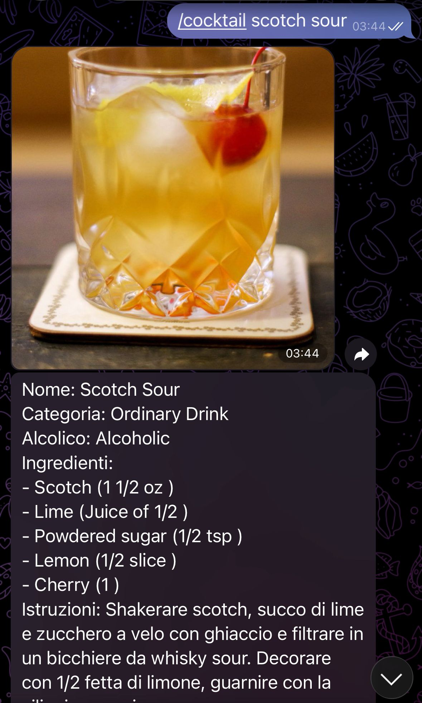
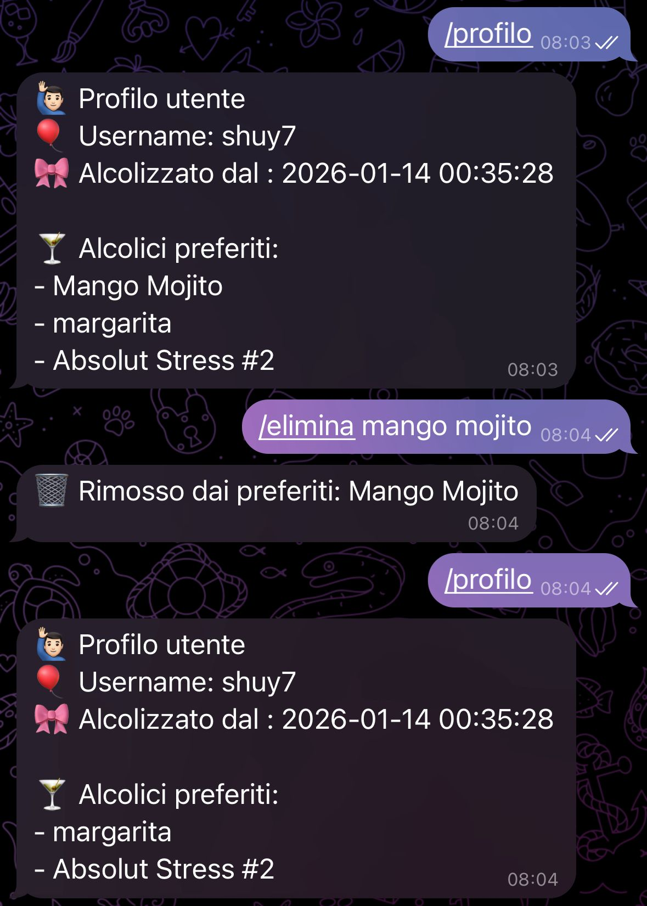

# CocktailBot – Telegram Bot

**CocktailBot** è un bot Telegram divertente e istrutivo che permette di scoprire cocktail, cercare ricette per ingrediente e gestire i propri preferiti.
Il bot utilizza l’API gratuita [TheCocktailDB](https://www.thecocktaildb.com/) per recuperare informazioni sui cocktail e SQLite per memorizzare utenti, cronologia e preferiti.

---

## 📌 Funzionalità e Comandi

| Comando | Descrizione                                                                                                                           |
|---------|---------------------------------------------------------------------------------------------------------------------------------------|
| `/start` | Messaggio di benvenuto con GIF casuale |
| `/random` | Ottieni un cocktail casuale con immagine e descrizione                                                                                |
| `/cocktail <nome>` | Informazioni dettagliate su un cocktail specifico                                                                                     |
| `/ingredient <ingrediente>` | Lista di cocktail contenenti l’ingrediente specificato                                                                                |
| `/adoro <nome>` | Aggiungi un cocktail ai tuoi preferiti                                                                                                |
| `/elimina <nome>` | Rimuovi un cocktail dai tuoi preferiti                                                                                                |
| `/profilo` | Mostra i tuoi cocktail preferiti e statistiche personali                                                                              |
| `/help` | Mostra la lista completa dei comandi disponibili                                                                                      |

---

## 🛠 Tecnologie Utilizzate

- **Linguaggio:** Java 21
- **Build Tool:** Maven
- **Telegram Library:** TelegramBots Java Library
- **Database:** SQLite
- **API Esterna:** [TheCocktailDB API](https://www.thecocktaildb.com/)

---

## 📚 Link Utili

- [Documentazione API TheCocktailDB](https://www.thecocktaildb.com/api.php)
- [TelegramBots Java Library](https://github.com/rubenlagus/TelegramBots)
- [BotFather su Telegram](https://t.me/BotFather)

---
## 📷 ScreenShot utilizzo

---
### ✅ Note

- Dopo il comando `/random` o `/cocktail <nome>` comparirà un bottone "❤️ Adoro" per aggiungere subito il cocktail ai preferiti.
- Il bot tiene traccia dei cocktail aggiunti e rimossi tramite i comandi `/adoro` e `/elimina`.
